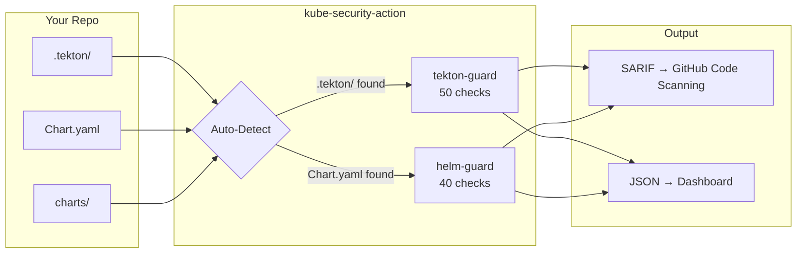

# kube-security-action

Unified GitHub Action for Kubernetes security scanning

[Quick Start](getting-started/quickstart.md){ .md-button .md-button--primary }
[GitHub](https://github.com/ugiordan/kube-security-action){ .md-button }

---

## How It Works

One Action, automatic detection. Add it to your workflow and it runs the right security tools based on what's in your repo.



---

## Quick Start

```yaml
name: Security Scan
on: [push, pull_request]

jobs:
  scan:
    runs-on: ubuntu-latest
    permissions:
      security-events: write
    steps:
      - uses: actions/checkout@v4
      - uses: ugiordan/kube-security-action@v1
```

That's it. The action detects `.tekton/` and `Chart.yaml` automatically.

---

## What Gets Scanned

<div class="grid cards" markdown>

-   :material-pipe:{ .lg .middle } **Tekton Pipelines**

    ---

    50 checks for PipelineRun, Pipeline, Task, TriggerTemplate, EventListener. Catches mutable refs, injection, privilege escalation, and pipeline logic manipulation.

    [:octicons-arrow-right-24: tekton-guard](tools/tekton-guard.md)

-   :material-kubernetes:{ .lg .middle } **Helm Charts**

    ---

    40 checks for Chart.yaml, values.yaml, and templates. Catches dependency pinning, tpl injection, OLM security, and CVE-based risks.

    [:octicons-arrow-right-24: helm-guard](tools/helm-guard.md)

</div>

---

## Features

<div class="grid cards" markdown>

-   :material-auto-fix:{ .lg .middle } **Auto-Detection**

    ---

    Detects `.tekton/` directories and `Chart.yaml` files. Runs only the relevant tools. No configuration needed.

-   :material-shield-check:{ .lg .middle } **90 Combined Checks**

    ---

    50 tekton-guard checks + 40 helm-guard checks. All grounded in real CVEs and documented attack techniques.

-   :material-file-document:{ .lg .middle } **SARIF Upload**

    ---

    Automatically uploads findings to GitHub Code Scanning. Findings appear as security alerts on your PRs.

-   :material-tune:{ .lg .middle } **Configurable**

    ---

    Custom config files, severity thresholds, tool selection. Works with existing `.tekton-guard.yaml` and `.helm-guard.yaml`.

</div>

---

## Next Steps

<div class="grid cards" markdown>

-   [Quick Start Guide](getting-started/quickstart.md)
-   [Configuration Options](getting-started/configuration.md)
-   [Action Inputs Reference](reference/inputs.md)
-   [Tool Documentation](tools/tekton-guard.md)

</div>
